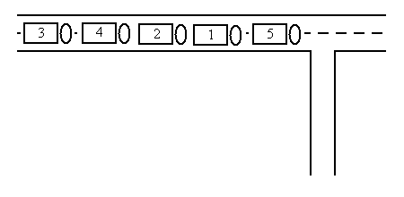
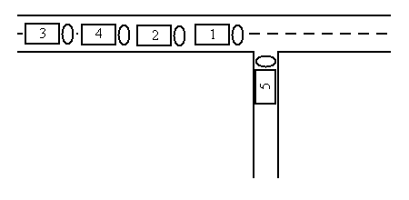
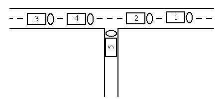
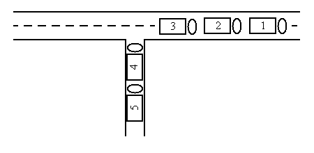
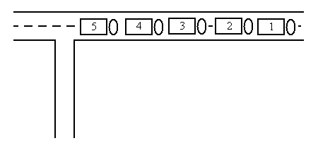

# Daily Coding Practicing

Self-Improving my Algorithmic coding skills.

- Mar 20: [Day 3: Street Parade](https://github.com/thu-hoai/daily-coding-practicing#day-3-street-parade)
- Mar 19: [Day 2: Mass of Molecule](https://github.com/thu-hoai/daily-coding-practicing#day-2-mass-of-molecule)<br>
- Mar 18: [Day 1: Transform the Expression](https://github.com/thu-hoai/daily-coding-practicing#day-1-transform-the-expression)<br>


## Day 3: Street Parade
_[Stack and Queue ](https://www.spoj.com/problems/STPAR/)_

For sure, the love mobiles will roll again on this summer's street parade. Each year, the organisers decide on a fixed order for the decorated trucks. Experience taught them to keep free a side street to be able to bring the trucks into order.

The side street is so narrow that no two cars can pass each other. Thus, the love mobile that enters the side street last must necessarily leave the side street first. Because the trucks and the ravers move up closely, a truck cannot drive back and re-enter the side street or the approach street.

You are given the order in which the love mobiles arrive. Write a program that decides if the love mobiles can be brought into the order that the organisers want them to be.

Input

```
There are several test cases. The first line of each test case contains a single number n, the number of love mobiles. The second line contains the numbers 1 to n in an arbitrary order. All the numbers are separated by single spaces. These numbers indicate the order in which the trucks arrive in the approach street. No more than 1000 love mobiles participate in the street parade. Input ends with number 0.

Sample input:
5
5 1 2 4 3
0

```

Output
```
For each test case your program has to output a line containing a single word "yes" if the love mobiles can be re-ordered with the help of the side street, and a single word "no" in the opposite case.


Sample output:
yes
```


`Illustration`

The sample input reflects the following situation:



The five trucks can be re-ordered in the following way:








## Day 2: Mass of Molecule

_[Stack and Queue ](https://www.spoj.com/problems/MMASS/)_

A molecule can be defined as a sequence of atoms and represented by a chemical formula consisting of letters denoting these atoms. E.g. letter H denotes atom of hydrogen, C denotes atom of carbon, O denotes atom of oxygen, formula COOH represents molecule consisting of one atom of carbon, two atoms of oxygen and one atom of hydrogen.

To write some formulas efficiently, we use the following rules. Letters denoting some atoms can be grouped by enclosing in parentheses, e.g. formula CH(OH) contains group OH. Groups can be nested – a group can also contain other groups. To simplify a formula, consecutive occurrences of the same letter can be replaced with that letter followed by a number of these occurrences. E.g. formula COOHHH can be written as CO2H3 and it represents a molecule consisting of one atom of carbon, two atoms of oxygen and three atoms of hydrogen. Furthermore, consecutive occurrences of the same group can be replaced with that group followed by a number of these occurrences. E.g. formula CH (CO2H) (CO2H) (CO2H) can be written as CH(CO2H)3 and molecule represented by both those formulas consists of four atoms of carbon, four atoms of hydrogen and six atoms of oxygen. A number written after a letter or a group is always greater than or equal to 2 and less than or equal to 9. A mass of a molecule is a sum of masses of all its atoms. One atom of hydrogen has mass 1, one atom of carbon has mass 12 and one atom of oxygen has mass 16.

Write a program that will calculate a mass of a molecule.

Input
```
The first and only line of input file contains a formula of a molecule whose mass needs to be determined. A formula of a molecule will consist of characters H, C, O, (, ) , 2, 3, ..., 9 only. Its length will be less or equal to 100 characters.
```

Output
```
The first and only line of output file should contain a mass of a molecule represented with a given formula. The result will always be less than or equal to 10,000.
```

For Example
```
COOH --> 45
CH(CO2H)3 --> 148
((CH)2(OH2H)(C(H))O)3 --> 222

```


## Day 1: Transform the Expression

[_Stack and Queue_](https://www.spoj.com/problems/ONP/)

Transform the algebraic expression with brackets into RPN form (Reverse Polish Notation). Two-argument operators: +, -, *, /, ^  (priority from the lowest to the highest), brackets ().
Operands: only letters: a,b,...,z. Assume that there is only one RPN form (no expressions like a*b*c).

Input
```
t [the number of expressions <= 100]
expression [length <= 400]
[other expressions]
```
Text grouped in [ ] does not appear in the input file.

Output
```
The expressions in RPN form, one per line.
```

Example
```
Input:
3
(a+(b*c))
((a+b)*(z+x))
((a+t)*((b+(a+c))^(c+d)))

Output:
abc*+
ab+zx+*
at+bac++cd+^*
```

